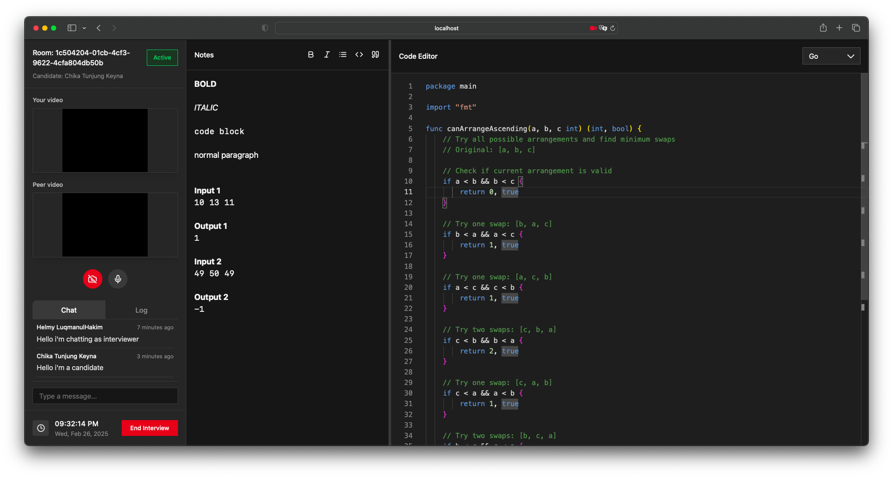

<div align="center">

# CodePair

### Real-time Technical Interview Platform

[](https://golang.org/)
[](https://nodejs.org/)



</div>

## Overview

CodePair is a platform for conducting remote technical interviews with integrated code editing and real-time communication features. It helps technical teams evaluate candidates through live coding sessions with built-in video, chat, and collaborative code editing capabilities.

### Frontend

- **Framework:** React with TypeScript + Tanstack, TailwindCSS
- **Editor:** Monaco Editor, TipTap (for the Notes)

### Backend

- **HTTP Servers:** Gin (Core) + nbio (Non-blocking HTTP Server), Fiber (Peer)
- **Database:** PostgreSQL, GORM
- **Real-time:** WebRTC, WebSocket
- **Utils:** Zap Logger, JWT

## Application Screenshots

### Dashboard & Room Management


### Account Management


### Interview Sessions


### Authentication


## Getting Started

### Prerequisites

| Tool    | Version |
| ------- | ------- |
| Node.js | v22+    |
| Go      | v1.22+  |
| Docker  | Latest  |
| PNPM    | v8+     |

### Installation

1. Clone the repository:

```bash
git clone https://github.com/elskow/codepair.git
cd codepair
```

2. Set up the development environment:

```bash
make setup
```

3. Start the development servers:

```bash
make dev
```

### Development Commands

| Command           | Description              |
| ----------------- | ------------------------ |
| `make dev-deps`   | Install dependencies     |
| `make dev`        | Start all services       |
| `make dev-core`   | Start core service       |
| `make dev-peer`   | Start peer service       |
| `make dev-client` | Start client application |
| `make stop`       | Stop all services        |
| `make clean`      | Clean up environment     |

## Architecture

<div align="center">


</div>

CodePair follows a microservices architecture with three main components:

- **Core Service**: Handles business logic and data management
- **Peer Service**: Manages WebRTC connections and real-time communication
- **Client Application**: Provides the user interface and interaction layer
